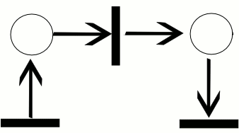
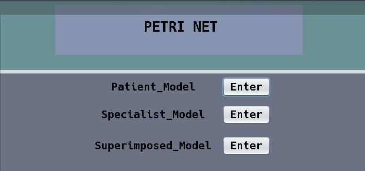
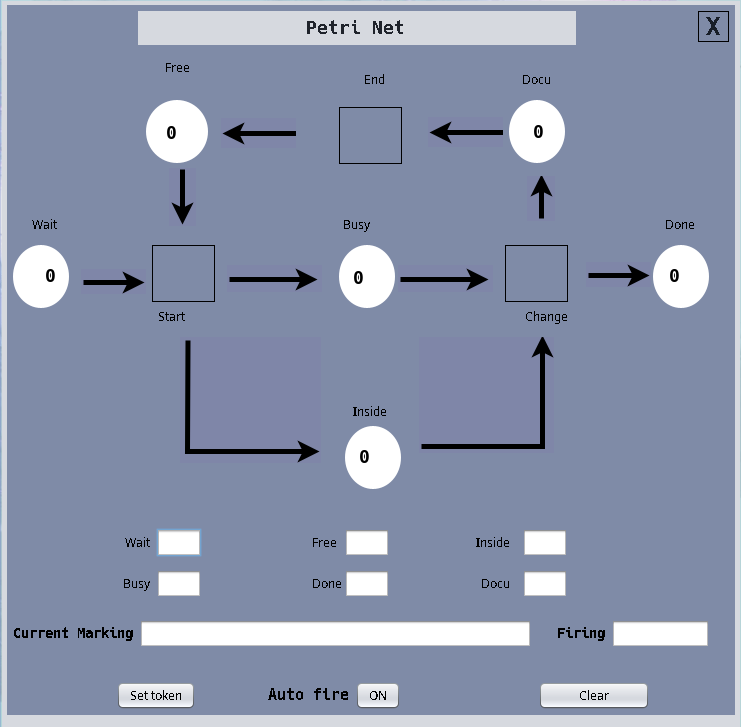

<!-- PROJECT LOGO -->
<div align="center">
  <a href="https://github.com/CaoHoangKiet222/Application-PetriNet">
    
  </a>

<h3 align="center">Petri-Networks</h3>

  <p align="center">
    Create a Petri Net model of the process flow in the outpatient clinic of hospital 
    <br />
    <a href="Petri_networks.pdf"><strong>Explore the docs »</strong></a>
    <br />
    <br />
    <a href="https://github.com/CaoHoangKiet222/Application-PetriNet/issues" target="_blank">Report Bug</a>
    ·
    <a href="https://github.com/CaoHoangKiet222/Application-PetriNet/issues/issues" target="_blank">Request Feature</a>
  </p>
</div>

<!-- TABLE OF CONTENTS -->
<details>
  <summary>Table of Contents</summary>
  <ol>
    <li>
      <a href="#about-the-project">About The Project</a>
      <ul>
        <li><a href="#built-with">Built With</a></li>
      </ul>
    </li>
    <li>
      <a href="#getting-started">Getting Started</a>
      <ul>
        <li><a href="#prerequisites">Prerequisites</a></li>
        <li><a href="#installation">Installation</a></li>
      </ul>
    </li>
    <li><a href="#usage">Usage</a></li>
  </ol>
</details>

<!-- ABOUT THE PROJECT -->

## About The Project

<div  align="center">
    
</div>

#### Process Description

The specialist receives patients in the outpatient clinic of the hospital. At any given time, the specialist can be in one of **three states**:

1. **Free:** The specialist is waiting for the next patient to arrive.
2. **Busy:** The specialist is currently treating a patient.
3. **Docu:** The specialist is documenting the result of the treatment.

Similarly, every patient who visits the specialist can be in one of three states:

1. **Wait:** The patient is waiting for their turn to be treated, and the value 𝑛 is the number of patients waiting in line.
2. **Inside:** The patient is currently being treated by the specialist.
3. **Done:** The patient has been treated by the specialist and their treatment is complete.

#### Event Data

Three events are important for this business process:

1. **Start:** This event represents the specialist starting the treatment of a patient.
2. **Change:** This event represents the specialist finishing the treatment of a patient and starting to document the results of the treatment.
3. **End:** This event represents the specialist completing the documentation of the treatment results.

### Built With

- [![javax.swing][javax.swing-shield]][javax.swing-url]
- [![Overleaf][Overleaf-shield]][Overleaf-url]

<!-- GETTING STARTED -->

## Getting Started

To get a local copy up and running follow these simple example steps.

### Prerequisites

Please install java package.

### 📦 Installation

1. Clone the repo
   ```sh
   git clone https://github.com/CaoHoangKiet222/Application-PetriNet.git
   ```
2. Move to src directory
   ```sh
   cd ./Application-PetriNet/src
   ```
3. Start app
   ```sh
   ./run.sh ./PetriNet/PetriNet.java
   ```

<!-- USAGE EXAMPLES -->

## 🚀 Usage

[![Demo Screen Shot][demo1-screenshot]](https://github.com/CaoHoangKiet222//Application-PetriNet/images/demo1.png)

- Step 1: In **Wait**, **Inside** and **Done** states you can set as many tokens as you want
- Step 2: Click to **Auto Fire** event to auto run petri-net, you can click to **Start** and **Change** event to fire every token
- Step 3: Clear all states when done
- [x] Follow these steps you can do the same for others petri-net

<div  align="center">
    
</div>

<h1 align="center">🌟 Good Luck and Cheers! 🌟</h1>

[product-screenshot]: images/petrinet-product.png
[demo1-screenshot]: images/demo1.png
[demo2-screenshot]: images/demo2.png
[javax.swing-shield]: https://img.shields.io/badge/javax.swing-8A2BE2?style=for-the-badge&logo=java&logoColor=white
[javax.swing-url]: https://docs.oracle.com/javase/8/docs/api/javax/swing/package-summary.html
[Overleaf-shield]: https://img.shields.io/badge/Overleaf-47A141?style=for-the-badge&logo=overleaf&logoColor=white
[Overleaf-url]: https://www.overleaf.com
